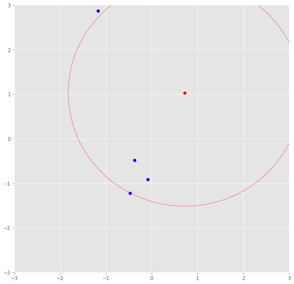
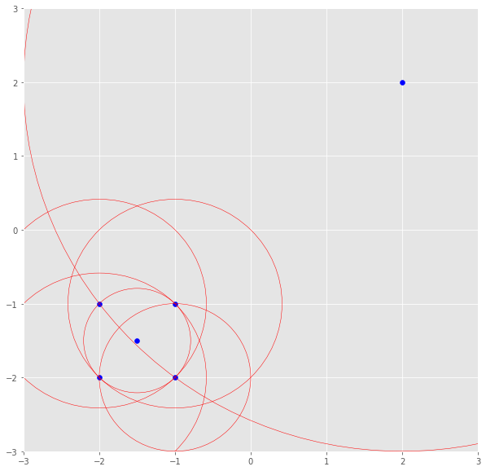

# Credit-Card-Fraud-Detection-via-Anamoly-Detection
Credit Card Fraud Detection using Isolation Forest Algorithm and Local Outlier Factor Algorithm

**It is important that credit card companies are able to recognize fraudulent credit card transactions so that customers are not charged for items that they did not purchase.**

## DATASET
This dataset presents transactions that occurred in two days(2013), where we have **492 frauds out of 284,807 transactions**. The **dataset is highly unbalanced**, the positive class (frauds) account for **0.172%** of all transactions.

It contains only numerical input variables which are the result of a PCA transformation. Features V1, V2, ... V28 are the principal components obtained with PCA( due to confidentiality issues, cannot provide the original features and more background information about the data.), the only features which have not been transformed with PCA are 'Time' and 'Amount'. 

Feature 'Time' contains the seconds elapsed between each transaction and the first transaction in the dataset. The feature 'Amount' is the transaction Amount, this feature can be used for example-dependant cost-senstive learning. Feature 'Class' is the response variable and it takes value 1 in case of fraud and 0 otherwise.
```
Given the class imbalance ratio, we recommend measuring the accuracy using the Area Under the 
Precision-Recall Curve (AUPRC).Confusion matrix accuracy is not meaningful for unbalanced 
classification.
```
***Due to the Large size of dataset and time-computation constraint, I chose only 10% of that dataset for this project.
(28481 records with 49 fraud cases)***
## RESULT
The heatmap of **Correlation matrix** showed almost no correlations between various attributes.

#### ACCURACY SCORE AND CLASSIFICATION REPORT COMPARISONS


Isolation Forest showed much better precision and recall than Local Outlier Factor while both had almost same accuracy.

To have better look at accuracy of the algorithms, I drew Precision-Recall curve and used AUPRC.
**The curve showed high precision and very low recall and thus area under curve was very low; as confirmed from above**


- A high area under the curve represents both high recall and high precision, where high precision relates to a low false positive rate, and high recall relates to a low false negative rate. 
- High scores for both show that the classifier is returning accurate results (high precision), as well as returning a majority of all positive results (high recall).
- A system with high recall but low precision returns many results, but most of its predicted labels are incorrect when compared to the training labels. 
- A system with high precision but low recall is just the opposite, returning very few results, but most of its predicted labels are correct when compared to the training labels.
- An ideal system with high precision and high recall will return many results, with all results labeled correctly.
## [UNSUPERVISED LEARNING ALGORITHMS](https://towardsdatascience.com/unsupervised-learning-with-python-173c51dc7f03)
Unsupervised Learning is a class of Machine Learning techniques to find the patterns in data. The data given to unsupervised algorithm are not labelled, which means only the input variables(X) are given with no corresponding output variables.
```
Yan Lecun, director of AI research, explains that unsupervised learning — teaching machines
to learn for themselves without having to be explicitly told if everything they do is 
right or wrong — is the key to “true” AI.
```
<br/>
The image to the left is an example of supervised learning; we use regression techniques to find the best fit line between the features. While in unsupervised learning the inputs are segregated based on features and the prediction is based on which cluster it belonged.

### [LOCAL OUTLIER FACTOR](https://towardsdatascience.com/local-outlier-factor-for-anomaly-detection-cc0c770d2ebe)
Local Outlier Factor (LOF) is a score that tells how likely a certain data point is an outlier/anomaly.<br/>LOF ≈1 ⇒ not outlier<br/>LOF ≫1 ⇒ outlier<br/>
The LOF is a calculation that looks at the neighbors of a certain point to find out its density and compare this to the density of other points later on.<br/>
**Parameter k, is the number of neighbors the LOF calculation is considering** While a small k has a more local focus, i.e. looks only at nearby points, it is more erroneous when having much noise in the data. A large k, however, can miss local outliers.

**k-distance** <br/>
Using parameter k, it is the distance of a point to its kth neighbor. If k was 3, the k-distance would be the distance of a point to the third closest point.<br/>


**Reachability distance** <br/>
This distance measure is simply the maximum of the distance of two points and the k-distance of the second point.<br/>
**reach-dist(a,b) = max{k-distance(b), dist(a,b)}**

>Basically, if point a is within the k neighbors of point b, the reach-dist(a,b) will be the k-distance of b. Otherwise, it will be the real distance of a and b. This is just a “smoothing factor”.

**Local reachability density(lrd)**<br/>
To get the lrd for a point a, we will 
- calculate the reachability distance of a to all its k nearest neighbors 
- take the average of that number.
The lrd is then simply the inverse of that average.<br/>
**lrd(a) = 1/(sum(reach-dist(a,n))/k)** <br/>
>we are talking about densities and, therefore, the longer the distance to the next neighbors, the sparser the area the respective point is located in. Hence, the less dense — the inverse.


The lrd of the upper right point is the average reachability distance to its nearest neighbors which are points (-1, -1), (-1.5, -1.5) and (-1, -2). These neighbors, however, have other lrds as their nearest neighbors don’t include the upper right point.

**LOF**<br/>
Fnally, k ratios of the lrd of each point to its neighboring points will be calculated and averaged.<br/>
The LOF is basically the **average ratio of the lrd of point a to the lrds to its neighboring points**.<br/>
- If the ratio is greater than 1, the lrd of point a is on average greater than the lrd of its neighbors and, thus, from point a, we have to travel longer distances to get to the next point or cluster of points than from a’s neighbors to their next neighbors.
- If the density of a point is much smaller than the densities of its neighbors (LOF ≫1), the point is far from dense areas and, hence, an outlier.
>**Keep in mind, the neighbors of a point a may don’t consider a a neighbor as they have points in their reach which are way closer.**

### [ISOLATION FOREST](https://towardsdatascience.com/outlier-detection-with-isolation-forest-3d190448d45e)
