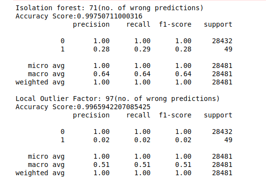
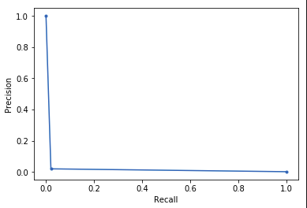

# Credit-Card-Fraud-Detection-via-Anamoly-Detection
Credit Card Fraud Detection using Isolation Forest Algorithm and Local Outlier Factor Algorithm

**It is important that credit card companies are able to recognize fraudulent credit card transactions so that customers are not charged for items that they did not purchase.**

## DATASET
This dataset presents transactions that occurred in two days(2013), where we have **492 frauds out of 284,807 transactions**. The **dataset is highly unbalanced**, the positive class (frauds) account for **0.172%** of all transactions.

It contains only numerical input variables which are the result of a PCA transformation. Features V1, V2, ... V28 are the principal components obtained with PCA( due to confidentiality issues, cannot provide the original features and more background information about the data.), the only features which have not been transformed with PCA are 'Time' and 'Amount'. 

Feature 'Time' contains the seconds elapsed between each transaction and the first transaction in the dataset. The feature 'Amount' is the transaction Amount, this feature can be used for example-dependant cost-senstive learning. Feature 'Class' is the response variable and it takes value 1 in case of fraud and 0 otherwise.
```
Given the class imbalance ratio, we recommend measuring the accuracy using the Area Under the 
Precision-Recall Curve (AUPRC).Confusion matrix accuracy is not meaningful for unbalanced 
classification.
```
***Due to the Large size of dataset and time-computation constraint, I chose only 10% of that dataset for this project.
(28481 records with 49 fraud cases)***
## RESULT
The heatmap of **Correlation matrix** showed almost no correlations between various attributes.

#### ACCURACY SCORE AND CLASSIFICATION REPORT COMPARISONS


Isolation Forest showed much better precision and recall than Local Outlier Factor while both had almost same accuracy.

To have better look at accuracy of the algorithms, I drew Precision-Recall curve and used AUPRC.
**The curve showed high precision and very low recall and thus area under curve was very low; as confirmed from above**


- A high area under the curve represents both high recall and high precision, where high precision relates to a low false positive rate, and high recall relates to a low false negative rate. 
- High scores for both show that the classifier is returning accurate results (high precision), as well as returning a majority of all positive results (high recall).
- A system with high recall but low precision returns many results, but most of its predicted labels are incorrect when compared to the training labels. 
- A system with high precision but low recall is just the opposite, returning very few results, but most of its predicted labels are correct when compared to the training labels.
- An ideal system with high precision and high recall will return many results, with all results labeled correctly.
## UNSUPERVISED LEARNING ALGORITHMS
### LOCAL OUTLIER FACTOR
### ISOLATION FOREST
