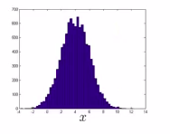

# Credit-Card-Fraud-Detection-via-Anamoly-Detection
Credit Card Fraud Detection using Isolation Forest Algorithm and Local Outlier Factor Algorithm

**It is important that credit card companies are able to recognize fraudulent credit card transactions so that customers are not charged for items that they did not purchase.**

## DATASET
This dataset presents transactions that occurred in two days(2013), where we have **492 frauds out of 284,807 transactions**. The **dataset is highly unbalanced**, the positive class (frauds) account for **0.172%** of all transactions.

It contains only numerical input variables which are the result of a PCA transformation. Features V1, V2, ... V28 are the principal components obtained with PCA( due to confidentiality issues, cannot provide the original features and more background information about the data.), the only features which have not been transformed with PCA are 'Time' and 'Amount'. 

Feature 'Time' contains the seconds elapsed between each transaction and the first transaction in the dataset. The feature 'Amount' is the transaction Amount, this feature can be used for example-dependant cost-senstive learning. Feature 'Class' is the response variable and it takes value 1 in case of fraud and 0 otherwise.
```
Given the class imbalance ratio, we recommend measuring the accuracy using the Area Under the 
Precision-Recall Curve (AUPRC).Confusion matrix accuracy is not meaningful for unbalanced 
classification.
```
***Due to the Large size of dataset and time-computation constraint, I chose only 10% of that dataset for this project.
(28481 records with 49 fraud cases)***
## RESULT
The heatmap of **Correlation matrix** showed almost no correlations between various attributes.

#### ACCURACY SCORE AND CLASSIFICATION REPORT COMPARISONS


Isolation Forest showed much better precision and recall than Local Outlier Factor while both had almost same accuracy.

To have better look at accuracy of the algorithms, I drew Precision-Recall curve and used AUPRC.
**The curve showed high precision and very low recall and thus area under curve was very low; as confirmed from above**


- A high area under the curve represents both high recall and high precision, where high precision relates to a low false positive rate, and high recall relates to a low false negative rate. 
- High scores for both show that the classifier is returning accurate results (high precision), as well as returning a majority of all positive results (high recall).
- A system with high recall but low precision returns many results, but most of its predicted labels are incorrect when compared to the training labels. 
- A system with high precision but low recall is just the opposite, returning very few results, but most of its predicted labels are correct when compared to the training labels.
- An ideal system with high precision and high recall will return many results, with all results labeled correctly.

## ANAMOLY DETECTION
**Tt's mainly for unsupervised problem, but there's some aspects of it that are also very similar to sort of the supervised learning problem.**

**Motivating Example:** Imagine that you're a manufacturer of aircraft engines, and as your aircraft engines roll off the assembly line, you're doing, QA or quality assurance testing, and as part of that testing you measure features of your aircraft engine, like heat generated, the vibrations and so on(these were actually the features that were collected off actual aircraft engines), if you have manufactured "m" aircraft engines, plot your data,:<br/>
<br/>
So, each point(cross) is one of the unlabeled examples.<br/>

**So, the anomaly detection problem is the following:** The next day, you have a new aircraft engine that rolls off the assembly line and your new aircraft engine has some set of features x<sub>test</sub>. What the anomaly detection problem is, we want to know if this aircraft engine is anomalous in any way,(this engine should undergo further testing) else if it looks like an okay engine, it's okay to just ship it to a customer without further testing.<br/>
So, if your new aircraft engine looks like these green cross, it can be identified as okay or anamoly.<br/>
<br/>

### DENSITY DETECTION
**Formally in the anomaly detection problem**, we're given some data sets, x<sub>1</sub> through x<sub>m</sub> of examples, and we usually *assume that these examples are normal or non-anomalous examples*, and we want an algorithm to tell us if some new example x<sub>test</sub> is anomalous.<br/>
So given the unlabeled training set, build a model for probability of x, p(x), where x are the features.
And having built a model, we're then going to say that for the new aircraft engine, if p(x<sub>test</sub>) is less than some epsilon(threshold) then we flag this as an anomaly else it looks okay.<br/>
<br/>
Points that lie, somewhere in the middle, will have high probability,whereas points a little bit further out have lower probability.

Example Application: **Monitoring computers in a data center**  If you have a lot of machines in a computer cluster or in a data center, we can compute features at each machine: how much memory used, number of disc accesses, CPU load. As well as more complex features like what is the CPU load on this machine divided by the amount of network traffic on this machine. Then given the dataset of how your computers in your data center usually behave, you can **model(p(x)) the probability of these machines having different amounts of memory use or probability of these machines having different numbers of disc accesses or different CPU loads** and so on. And if you ever have a machine whose p(x), is very small then you know that machine is behaving unusually and maybe that machine is about to go down, flag that for review by a system administrator.<br/>
And this is actually being used today by various data centers to watch out for unusual things happening on their machines.  

### Gaussian(Normal) Distribution

this is the plot of p(x) wrt fixed mean and variance.

<br/>
this denotes that the p(x) or the gaussian density is parameterized by the two parameters: mean and variance(i.e,sigma<sup>2</sup>; sigma denotes standard devidation).

<br/>

### The Parameter Estimation Problem
Given my data set of "m" examples, you suspect that these examples came from a Gaussian distribution, then, estimate what are the values of mean and variance.<br/>
<br/>
**In the variance formula, ML people use m in denominator while in statistics it is(m - 1); which is same given m is large. Two versions have slightly different theoretical math properties. But in practice it really makes very little difference.**

### Develop an Anomaly Detection Algorithm using Gaussian(Normal) Distribution
We're going to try to figure out what are high probability features, what are lower probability types of features.<br/>
We are going to do is model p(x), where x is a vector, as:<br/>
Assume that the feature, x<sub>(i)</sub>, is distributed according to a Gaussian distribution, with some mean, mu<sub>(i)</sub> and some variance, (sigma<sub>2</sub>)<sub>(i)</sub>. So,<br/>
<br/>
The problem of estimating this distribution p(x), is called the **problem of density estimation**.

<br/>

### Real-Number evaluation for your algorithm
Do I include this feature in model or not. If you can run the algorithm with the feature, and run the algorithm without the feature, and just get back a number that tells you, did it improve or worsen performance to add this feature? Then it gives you a much better way with which to decide whether or not to include that feature.
- Assume you have some labeled data: **y = 0 to denote the normal or the non-anomalous example and y = 1 to denote the anomalous examples** So, so far, we have beem treating anomaly detection as an unsupervised learning problem, using unlabeled data. But if you have some labeled data that specifies what are some anomalous examples, and what are some non-anomalous examples, then this is the standard way of evaluating an anomaly detection algorithm.
- Think of training set as still unlabeled training set; large collection of normal, non-anomalous examples(t's actually okay even if a few anomalies slip into the unlabeled training set).
- For both the cross validation and test sets, assume that we can include a few known anamolous examples in them.

Example:
- we have 10K normal aircraft engines(okay even if a few flawed engine slips into the set of 10,000; assuming that the vast majority of these 10,000 examples are good and normal non-anomalous engines.)
- 20 flawed/anamolous engines<br/>
**Then, a fairly typical way to split it into the training set, cross validation set and test set(60%-20%-20%) would be as follows:**<br/>
- Unlabeled training set: 6K good engines(out of thse 10K),i.e, ex. with y = 0. This set is used to fit p(x)
- Cross-Validation Set: 2K good engines(out of left out 4K from above) + 10 flawed engines
- Test Set: 2K good engine + 10 flawed (both from remaining data)
**Putting same 4K in CV and test set not a good ML practice**

<br/>
1. Take the unlabeled training set(majorly normal), and to fit the model p(x). It will fit all those parameters for all the Gaussians on this data.
2. On the cross validation and the test set, we're going to think of the anomaly detention algorithm as trying to predict the value of y.<br/>
**And this puts us somewhat more similar to the supervised learning setting, right? Where we have label test set and our algorithm is making predictions on these labels and so we can evaluate it you know by seeing how often it gets these labels right.**

**The good evaluation metrics**: Dataset is skewed so Classification Accuracy can't be used. We use Precision, Recall, F1-Score, etc

**Choosing Epsilon and/or Features**: Try many different values of epsilon and/or different features, and then pick the value of epsilon that, let's say, maximizes f1 score(does well) on your cross validation set.

### Anomaly Detection vs. Supervised Learning
Above we talked about the process of evaluating an anomaly detection algorithm. And there we started to use some labeled data with examples that we knew were either anomalous or not anomalous. <br/>
And so, the question then arises, **if we have the label data, that we have some examples and know the anomalies, and some of them will not be anomalies. Why don't we just use a supervised learning algorithm to predict whether y = 0 or Y equals 1?

<br/>
- In anamoly detection, when we're doing the process of estimating p(x), affecting all those Gaussian parameters, we need only negative examples to do that. So if you have a lot negative data(normal data;y=0), we can still fit p(x) pretty well. In contrast, for supervised learning, more typically we would have a reasonably large number of both positive and negative examples.
- For anomaly detection applications, often there are very different types of anomalies.  There are so many things that could go wrong that could the aircraft engine.,etc. And so if that's the case, and if you have a pretty small set of positive examples, then it can be hard for an algorithm, difficult for an algorithm to learn from your small set of positive examples what the anomalies look like. And in particular, **future anomalies may look nothing like the ones you've seen so far**. So maybe in your set of positive examples, you've seen 5 or 10 or 20 different ways that an aircraft engine could go wrong. But maybe tomorrow, you need to detect a totally new set, a totally new type of anomaly. A totally new way for an aircraft engine to be broken, that you've just never seen before. And if that's the case, it might be more promising to just **model the negative examples with this sort of gaussian model p(x) instead of try to hard to model the positive examples(like we do in supervised learning algorithms).** Because tomorrow's anomaly may be nothing like the ones you've seen so far.<br/> **In contrast**, in some other problems, you have enough positive examples for an algorithm to get a sense of what the positive examples are like. In particular, **if you think that future positive examples are likely to be similar to ones in the training set**; then in that setting, it might be more reasonable to have a supervised learning algorithm that looks at all of the positive examples, looks at all of the negative examples, and uses that to try to distinguish between positives and negatives.<br/>

**Comparison by Example:** 
- For the **spam problem** we usually have enough examples of spam email to see most of these different types of spam email because we have a large set of examples of spam. And that's why we usually think of spam as a supervised learning setting even though there are many different types of spam emails.
- **Fraud detection**. If you have *many different types of ways for people to try to commit fraud* and a relatively *small number of fraudulent users on your website*, then use an anomaly detection algorithm. In contrast, if you're a very major online retailer and if you actually have had a lot of people commit fraud on your website(you actually have a lot of examples of y=1,) **then sometimes fraud detection could actually shift over to the supervised learning column. But, if you haven't seen that many examples of users doing strange things on your website, then more frequently fraud detection is actually treated as an anomaly detection algorithm rather than a supervised learning algorithm.**
-  For some manufacturing processes(same applies for monitoring machines in a data center), if you manufacture in very large volumes and you see a lot of bad examples, maybe manufacturing can shift to the supervised learning column as well. But if you haven't seen that many bad examples in your manufacturing process do the anomaly detection. 
- Whereas, email spam classification, weather prediction, and classifying cancers, if you have equal numbers of positive and negative examples, treat it as supervised learning problem.

### Choosing What Features to Use
When applying anomaly detection, one of the things that has a huge effect on how well it does, is what features you use.</br>
- Plot the data or the histogram of the data, to make sure that the data looks vaguely Gaussian before feeding it to anomaly detection algorithm(And, it'll usually work okay, even if your data isn't Gaussian, but this is sort of a nice sanitary check to run.).<br/>
<br/>

If plot a histogram of data,doesn't look like bell shaped curve, this is a very asymmetric distribution, it has a peak way off to one side.Then, play with different transformations(algo might work better) of the data in order to make it look more Gaussian.<br/>
Example: Take a log transformation of the data and re-plot the histogram</br>
<br/>
So,for example, what we can do is, replace data x<sub>1</sub> with log(x<sub>1</sub>), maybe replace data x<sub>2</sub> with log(x<sub>2</sub>+c)(c being some constant and try to make plot look as gaussian as possible), and replace data x<sub>3</sub> with x<sub>3</sub><sup>1/2</sup>(take root), replace data x<sub>4</sub> with x<sub>4</sub><sup>1/3</sup>. **So all these are the parameters you can play with to make it as gaussian as possible**

- Choosing What Features to Use via **Error Analysis Procedure**: train a complete algorithm, and run the algorithm on a cross validation set, and look at the examples it gets wrong, and see if we can come up with extra features to help the algorithm do better on the examples that it got wrong in the cross-validation set.<br/>
In anomaly detection, we are hoping that p(x) will be large for the normal examples and it will be small for the anomalous examples.And so a pretty **common problem would be if p(x) is comparable**, maybe both it is large for both the normal and the anomalous examples and the algorithm fails to flag anomalous example.<br/>
<br/>
If we use only feature x<sub>1</sub and fit gaussian to this, and let's say that my anomalous example takes on an x value of 2.5. So I plot my anomalous example(green cross). And it's kind of buried in the middle of a bunch of normal examples, and so, just this anomalous example that I've drawn in green, it gets a pretty high probability, where it's the height of the blue curve, and the algorithm fails to flag this as an anomalous example.
  
Solution is to look at the training examples (look at what went wrong with that particular aircraft engine), and see, if looking at that example can inspire me to come up with a new feature x<sub>2</sub>, that helps to distinguish between this bad example, compared to the rest of all the normal aircraft engines.<br/>
<br/>
So  my green example here, this anomaly, right, my x<sub>1</sub> value, is still 2.5. Then maybe my x<sub>2</sub> value, hopefully it takes on a very large value like 3.5 over there, or a very small value.

- So, **choose features that will take on either very, very large values, or very, very small values, for examples that I think might turn out to be anomalies.** 

**Example: monitoring the computers in a data center <br/>**:
Let's say that in the data set you think that CPU load the network traffic tend to grow linearly with each other. Maybe you are running a bunch of web servers, and so, here if one of the servers is serving a lot of users, Iyou have a very high CPU load, and have a very high network traffic.<br/>
One of the failure cases is if one of the computers has a job that gets stuck in some infinite loop, and so the CPU load grows, but the network traffic doesn't. In that case, to detect that type of anomaly,you can create a new feature, which might be CPU load divided by network traffic. It will take on a unusually large value if one of the machines has a very large CPU load but not that much network traffic and so this will be a feature **that will help your anomaly detection capture a certain type of anomaly**. 


## [UNSUPERVISED LEARNING ALGORITHMS](https://towardsdatascience.com/unsupervised-learning-with-python-173c51dc7f03)
Unsupervised Learning is a class of Machine Learning techniques to find the patterns in data. The data given to unsupervised algorithm are not labelled, which means only the input variables(X) are given with no corresponding output variables.
```
Yan Lecun, director of AI research, explains that unsupervised learning — teaching machines
to learn for themselves without having to be explicitly told if everything they do is 
right or wrong — is the key to “true” AI.
```
<br/>
The image to the left is an example of supervised learning; we use regression techniques to find the best fit line between the features. While in unsupervised learning the inputs are segregated based on features and the prediction is based on which cluster it belonged.

***A lot of machine learning algorithms suffer in terms of their performance when outliers are not taken care of. In order to avoid this kind of problems you could, for example, drop them from your sample, cap the values at some reasonable point (based on domain knowledge), transform the data or identify them***

### [LOCAL OUTLIER FACTOR](https://towardsdatascience.com/local-outlier-factor-for-anomaly-detection-cc0c770d2ebe)
Local Outlier Factor (LOF) is a score that tells how likely a certain data point is an outlier/anomaly.<br/>LOF ≈1 ⇒ not outlier<br/>LOF ≫1 ⇒ outlier<br/>
The LOF is a calculation that looks at the neighbors of a certain point to find out its density and compare this to the density of other points later on.<br/>
**Parameter k, is the number of neighbors the LOF calculation is considering** While a small k has a more local focus, i.e. looks only at nearby points, it is more erroneous when having much noise in the data. A large k, however, can miss local outliers.

**k-distance** <br/>
Using parameter k, it is the distance of a point to its kth neighbor. If k was 3, the k-distance would be the distance of a point to the third closest point.<br/>


**Reachability distance** <br/>
This distance measure is simply the maximum of the distance of two points and the k-distance of the second point.<br/>
**reach-dist(a,b) = max{k-distance(b), dist(a,b)}**

>Basically, if point a is within the k neighbors of point b, the reach-dist(a,b) will be the k-distance of b. Otherwise, it will be the real distance of a and b. This is just a “smoothing factor”.

**Local reachability density(lrd)**<br/>
To get the lrd for a point a, we will 
- calculate the reachability distance of a to all its k nearest neighbors 
- take the average of that number.
The lrd is then simply the inverse of that average.<br/>
**lrd(a) = 1/(sum(reach-dist(a,n))/k)** <br/>
>we are talking about densities and, therefore, the longer the distance to the next neighbors, the sparser the area the respective point is located in. Hence, the less dense — the inverse.

<br/>
The lrd of the upper right point is the average reachability distance to its nearest neighbors which are points (-1, -1), (-1.5, -1.5) and (-1, -2). These neighbors, however, have other lrds as their nearest neighbors don’t include the upper right point.

**LOF**<br/>
Fnally, k ratios of the lrd of each point to its neighboring points will be calculated and averaged.<br/>
The LOF is basically the **average ratio of the lrd of point a to the lrds to its neighboring points**.<br/>
- If the ratio is greater than 1, the lrd of point a is on average greater than the lrd of its neighbors and, thus, from point a, we have to travel longer distances to get to the next point or cluster of points than from a’s neighbors to their next neighbors.
- If the density of a point is much smaller than the densities of its neighbors (LOF ≫1), the point is far from dense areas and, hence, an outlier.
>**Keep in mind, the neighbors of a point a may don’t consider a a neighbor as they have points in their reach which are way closer.**

### [ISOLATION FOREST](https://towardsdatascience.com/outlier-detection-with-isolation-forest-3d190448d45e)
The main idea, which is _different from other popular outlier detection methods_, is that Isolation Forest explicitly identifies anomalies instead of profiling normal data points.<br/> 
Isolation Forest, like any tree ensemble method, is built on the basis of decision trees. In these trees, partitions are created by first randomly selecting a feature and then selecting a random split value between the minimum and maximum value of the selected feature.
>**In principle, outliers are less frequent than regular observations and are different from them in terms of values (they lie further away from the regular observations in the feature space). That is why by using such random partitioning they should be identified closer to the root of the tree (shorter average path length, i.e., the number of edges an observation must pass in the tree going from the root to the terminal node), with fewer splits necessary.**

<br/>
The idea of identifying a normal vs. abnormal observation. A normal point (on the left) requires more partitions to be identified than an abnormal point (right).

As with other outlier detection methods, an anomaly score is required for decision making. In case of Isolation Forest it is defined as:<br/>
<br/>
where h(x) is the path length of observation x, c(n) is the average path length of unsuccessful search in a Binary Search Tree and n is the number of external nodes

- Score close to 1 indicates anomalies
- Score much smaller than 0.5 indicates normal observations
- If all scores are close to 0.5 than the entire sample does not seem to have clearly distinct anomalies


